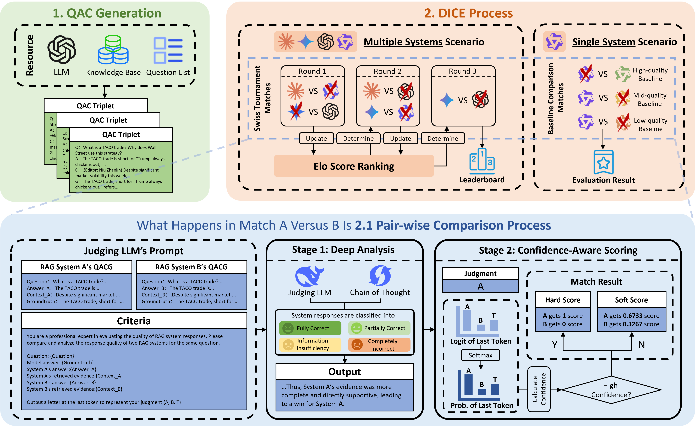

# DICE



Code for evaluating RAG systems with interpretable reasoning and probabilistic scoring.

This repository implements **DICE** (Discrete Interpretable Comparative Evaluation), a framework introduced in [ResponsibleFM @ NeurIPS 2025](https://openreview.net/forum?id=RNz4AfOfh3) for responsible, explainable, and confidence-aware RAG evaluation.

## Features

- Evidence-coupled reasoning for transparent decision-making  
- Probabilistic $\\{A, B, Tie\\}$ scoring for confidence-aware judgments  
- Efficient large-scale evaluation with Swiss-system tournament  
- Reproducible benchmarks for multi-system comparisons  

## Usage

1. Clone the repository:  
   ```bash
   git clone https://github.com/shiyan-liu/DICE.git
   cd DICE
   ```
2. Install dependencies:  
   ```bash
   pip install -r requirements.txt
   ```
3. [TBD: evaluation command for your system]

## Reference

If you use DICE in your work, please cite:

```bibtex
@inproceedings{liu2025dice,
  title={DICE: Discrete Interpretable Comparison Evaluation with Probabilistic Scoring for Retrieval-Augmented Generation},
  author={Liu, Shiyan and Ma, Jian},
  booktitle={Socially Responsible and Trustworthy Foundation Models at NeurIPS 2025}
}
```